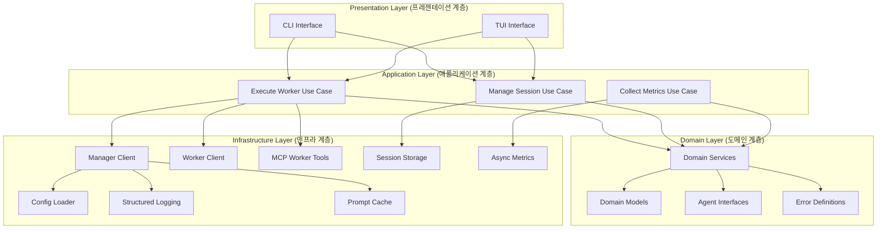
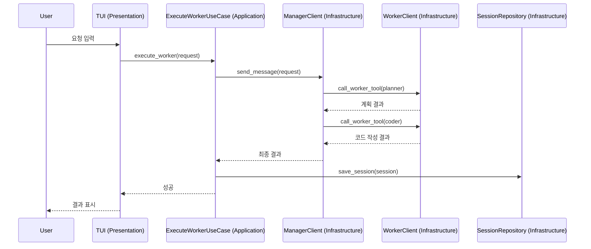
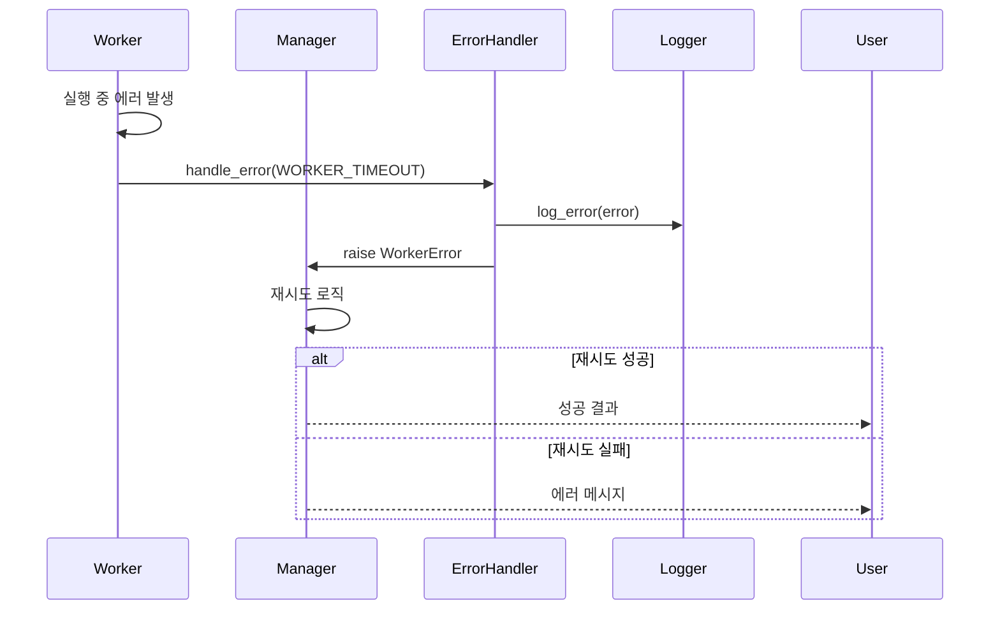

# 아키텍처 개요

Better-LLM은 Clean Architecture 원칙을 따르는 Multi-Agent 오케스트레이션 시스템입니다.

## 4-Layer Architecture



## 계층별 책임

### 1. Domain Layer (도메인 계층)

**위치**: `src/domain/`

**책임**:
- 비즈니스 규칙 정의
- 외부 의존성 없음 (순수 Python)
- 도메인 모델 및 인터페이스 정의

**주요 컴포넌트**:

- **Models** (`src/domain/models/`):
  - `Message`: 대화 메시지
  - `Session`: 세션 정보
  - `AgentConfig`: 에이전트 설정

- **Agents** (`src/domain/agents/`):
  - `BaseAgent`: 에이전트 인터페이스
  - `WorkerAgent`: Worker 에이전트 인터페이스

- **Errors** (`src/domain/errors/`):
  - `ErrorCode`: 에러 코드 정의
  - `BetterLLMError`: 커스텀 예외 클래스

**규칙**:
- 외부 라이브러리 의존 금지 (Claude SDK, structlog 등)
- 데이터 구조와 비즈니스 로직만 포함
- Infrastructure 계층에 의존하지 않음

### 2. Application Layer (애플리케이션 계층)

**위치**: `src/application/`

**책임**:
- 유스케이스 오케스트레이션
- Domain과 Infrastructure 연결
- 트랜잭션 관리

**주요 컴포넌트**:

- **Ports** (`src/application/ports/`):
  - `AgentPort`: 에이전트 실행 인터페이스
  - `StoragePort`: 저장소 인터페이스
  - `MetricsPort`: 메트릭 수집 인터페이스

- **Use Cases**:
  - `ExecuteWorkerUseCase`: Worker 실행
  - `ManageSessionUseCase`: 세션 관리
  - `CollectMetricsUseCase`: 메트릭 수집

**규칙**:
- Port 인터페이스를 통해 Infrastructure 호출
- 비즈니스 로직은 Domain에 위임
- 에러 처리 및 재시도 로직 포함

### 3. Infrastructure Layer (인프라 계층)

**위치**: `src/infrastructure/`

**책임**:
- 외부 시스템 연동
- Application Port 구현
- 기술적 세부사항 처리

**주요 컴포넌트**:

- **Claude** (`src/infrastructure/claude/`):
  - `ManagerClient`: Manager Agent 클라이언트
  - `WorkerClient`: Worker Agent 클라이언트

- **MCP** (`src/infrastructure/mcp/`):
  - `worker_tools.py`: MCP Worker Tools 정의 및 실행

- **Config** (`src/infrastructure/config/`):
  - `loader.py`: 설정 파일 로더

- **Storage** (`src/infrastructure/storage/`):
  - `session_storage.py`: 세션 저장소
  - `optimized_session_storage.py`: 최적화된 저장소 (압축, 백그라운드 저장)

- **Logging** (`src/infrastructure/logging/`):
  - `setup.py`: Structlog 설정
  - `error_tracker.py`: 에러 추적

- **Metrics** (`src/infrastructure/metrics/`):
  - `async_collector.py`: 비동기 메트릭 수집기

- **Cache** (`src/infrastructure/cache/`):
  - `prompt_cache.py`: 프롬프트 캐싱

**규칙**:
- Application Port 인터페이스 구현
- Domain 모델 사용 (참조만)
- 외부 라이브러리 의존 허용

### 4. Presentation Layer (프레젠테이션 계층)

**위치**: `src/presentation/`

**책임**:
- 사용자 인터페이스
- 입력 검증
- 출력 포맷팅

**주요 컴포넌트**:

- **CLI** (`src/presentation/cli/`):
  - `orchestrator.py`: CLI 진입점
  - `utils.py`: CLI 유틸리티

- **TUI** (`src/presentation/tui/`):
  - `tui_app.py`: Textual 기반 TUI

**규칙**:
- Application Use Case 호출
- 사용자 입력 검증
- 결과 포맷팅 및 출력

## 의존성 규칙

```
Presentation → Application → Domain ← Infrastructure
```

- **내부 계층 → 외부 계층**: 금지 (Domain은 Infrastructure에 의존 불가)
- **외부 계층 → 내부 계층**: 허용
- **의존성 역전**: Port 인터페이스를 통한 의존성 주입

### 의존성 역전 예시

```python
# Domain Layer: 인터페이스 정의
class StoragePort(ABC):
    @abstractmethod
    def save_session(self, session: Session) -> None:
        pass

# Infrastructure Layer: 구현
class SessionRepository(StoragePort):
    def save_session(self, session: Session) -> None:
        # 실제 저장 로직
        with open(f"sessions/{session.id}.json", "w") as f:
            json.dump(session.to_dict(), f)

# Application Layer: 인터페이스 사용
class ManageSessionUseCase:
    def __init__(self, storage: StoragePort):
        self.storage = storage  # 구체적 구현이 아닌 인터페이스 의존

    def save(self, session: Session):
        self.storage.save_session(session)
```

## 데이터 흐름

### 1. 사용자 요청 처리



### 2. 에러 처리 흐름



## 핵심 설계 원칙

### 1. 단일 책임 원칙 (Single Responsibility)
- 각 Worker는 하나의 역할만 수행
- Planner: 계획만, Coder: 코딩만

### 2. 개방-폐쇄 원칙 (Open-Closed)
- 새로운 Worker 추가 시 기존 코드 수정 불필요
- `config/agent_config.json`에 정의만 추가

### 3. 리스코프 치환 원칙 (Liskov Substitution)
- 모든 Worker는 `WorkerAgent` 인터페이스 구현
- 어떤 Worker든 교체 가능

### 4. 인터페이스 분리 원칙 (Interface Segregation)
- `AgentPort`, `StoragePort`, `MetricsPort` 분리
- 각 Use Case는 필요한 Port만 의존

### 5. 의존성 역전 원칙 (Dependency Inversion)
- Application은 Infrastructure 구현이 아닌 Port 인터페이스 의존
- DI Container를 통한 의존성 주입

## 확장 가이드

### 새로운 Worker 추가

1. **Domain**: Worker 인터페이스 정의 (필요시)
2. **Infrastructure**: Worker 프롬프트 작성 (`prompts/new_worker.txt`)
3. **Config**: `config/agent_config.json`에 Worker 추가
4. **MCP**: `worker_tools.py`에 Tool 정의 추가

### 새로운 Storage 추가

1. **Application**: `StoragePort` 인터페이스 정의
2. **Infrastructure**: `StoragePort` 구현 (예: `PostgresRepository`)
3. **DI**: 의존성 주입 설정 변경

### 새로운 UI 추가

1. **Presentation**: 새 UI 디렉토리 생성 (예: `web/`)
2. **Application**: 기존 Use Case 재사용
3. **Entry Point**: 새 진입점 추가 (예: `web_app.py`)

## 성능 고려사항

### 1. 비동기 처리
- 메트릭 수집: 백그라운드 스레드
- 세션 저장: 백그라운드 저장 옵션

### 2. 캐싱
- 프롬프트 캐싱: LRU 캐시 (TTL 1시간)
- API 응답 캐싱 (향후 구현)

### 3. 압축
- 세션 파일: gzip 압축 (30-50% 절감)
- 로그 파일: 로테이션 (자동 압축)

## 보안 고려사항

### 1. API 키 관리
- 환경 변수 사용 (하드코딩 금지)
- `.env` 파일 `.gitignore`에 추가

### 2. 입력 검증
- Presentation Layer에서 사용자 입력 검증
- Pydantic 모델을 통한 타입 검증

### 3. 에러 정보 노출
- 사용자에게는 간략한 에러 메시지
- 상세 정보는 로그 파일에만 기록

## 참고 자료

- [Clean Architecture - Robert C. Martin](https://blog.cleancoder.com/uncle-bob/2012/08/13/the-clean-architecture.html)
- [Hexagonal Architecture](https://alistair.cockburn.us/hexagonal-architecture/)
- [SOLID Principles](https://en.wikipedia.org/wiki/SOLID)
