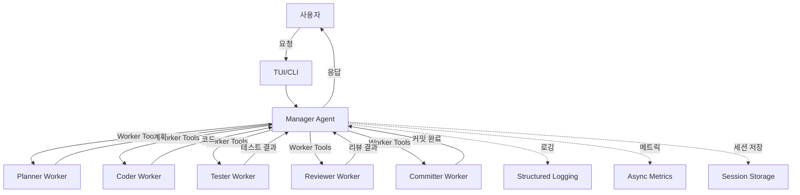

# Better-LLM Documentation

여러 Claude 에이전트가 하나의 대화 공간에서 협업하여 복잡한 소프트웨어 개발 작업을 자동화하는 오케스트레이션 시스템입니다.

## 주요 특징

### 🏗️ Clean Architecture 기반
- 4-Layer 구조 (Domain, Application, Infrastructure, Presentation)
- 테스트 가능하고 확장 가능한 설계
- 의존성 역전 원칙 (Dependency Inversion) 준수

### 🤖 Multi-Agent 협업
- **Planner**: 요구사항 분석 및 계획 수립
- **Coder**: 코드 작성 및 수정
- **Tester**: 테스트 실행 및 검증
- **Reviewer**: 코드 리뷰 및 품질 검증
- **Committer**: Git 커밋 및 PR 생성

### 🔧 MCP (Model Context Protocol)
- Anthropic의 표준 프로토콜 사용
- Manager Agent가 Worker Tools를 자동 호출
- 타입 안전한 인터페이스

### 📊 구조화된 로깅 및 메트릭
- Structlog 기반 JSON 로깅
- 비동기 메트릭 수집
- 실시간 에러 추적

### ⚡ 성능 최적화
- 프롬프트 캐싱 (API 호출 30-50% 절감)
- 세션 압축 저장 (디스크 공간 30-50% 절감)
- 백그라운드 저장 (저장 시간 70% 단축)

## 빠른 시작

### 설치

```bash
git clone https://github.com/simdaseul/better-llm.git
cd better-llm
./install.sh
```

### 환경 변수 설정

```bash
export ANTHROPIC_API_KEY='your-api-key-here'
```

### TUI 실행

```bash
better-llm
```

### CLI 실행

```bash
better-llm-cli "FastAPI로 /users CRUD 엔드포인트 구현해줘"
```

## 시스템 아키텍처



## 워크플로우 예시

1. **사용자 요청**: "FastAPI로 /users CRUD 엔드포인트 구현해줘"
2. **Planner**: 요구사항 분석 및 구현 계획 수립
3. **Coder**: 계획에 따라 코드 작성
4. **Reviewer**: 코드 품질 검토
5. **Tester**: 테스트 실행 및 검증
6. **Committer**: Git 커밋 및 PR 생성
7. **완료**: 사용자에게 결과 반환

## 주요 문서

### 시작하기
- [설치 가이드](guides/installation.md)
- [빠른 시작](guides/quickstart.md)
- [사용법](guides/usage.md)

### 아키텍처
- [아키텍처 개요](architecture.md)
- [Clean Architecture 채택](adr/0001-clean-architecture.md)
- [MCP 프로토콜](adr/0002-mcp-protocol.md)
- [Worker Agent 분리](adr/0003-worker-agents.md)

### API Reference
- [Domain Models](api/domain/models.md)
- [Infrastructure](api/infrastructure/manager.md)
- [Error Codes](api/domain/errors.md)

### ADR (Architecture Decision Records)
- [템플릿](adr/0000-template.md)
- [구조화된 로깅](adr/0004-structured-logging.md)
- [비동기 메트릭 수집](adr/0005-async-metrics.md)

## 기여하기

Better-LLM은 오픈소스 프로젝트입니다. 기여를 환영합니다!

1. Fork the repository
2. Create your feature branch (`git checkout -b feature/amazing-feature`)
3. Commit your changes (`git commit -m 'Add some amazing feature'`)
4. Push to the branch (`git push origin feature/amazing-feature`)
5. Open a Pull Request

자세한 내용은 [CONTRIBUTING.md](../CONTRIBUTING.md)를 참조하세요.

## 라이선스

MIT License - 자세한 내용은 [LICENSE](../LICENSE)를 참조하세요.

## 문의

- GitHub Issues: [https://github.com/simdaseul/better-llm/issues](https://github.com/simdaseul/better-llm/issues)
- Discussions: [https://github.com/simdaseul/better-llm/discussions](https://github.com/simdaseul/better-llm/discussions)
